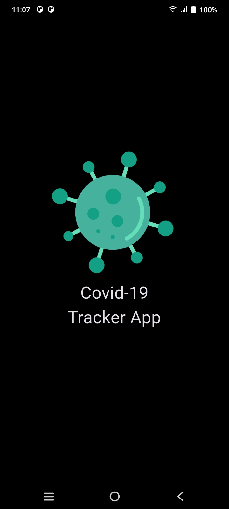
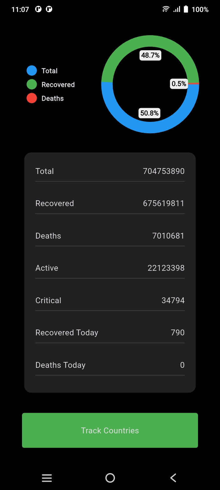
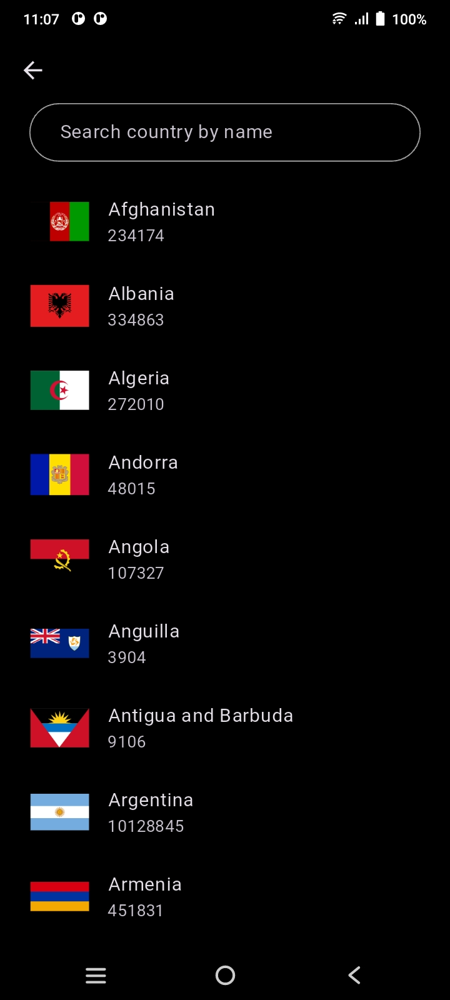
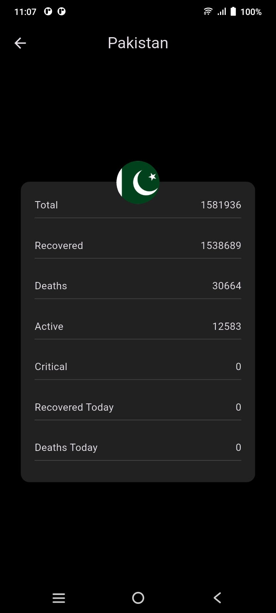

# 🦠 CovidCompass

A Flutter-powered COVID-19 tracking app that provides real-time global statistics, country-specific data, and visualizations to help users stay informed and safe.

## 📱 Screenshots

### 🚀 Animated Splash Screen


### 🌐 Global Dashboard


### 🔍 Search Functionality


### 📋 Detail Screen


## 🚀 Features

- 🌍 **Global & Country-specific Data**: Track cases, recoveries, and deaths across 200+ countries.
- 🔍 **Search Functionality**: Instantly search for any country’s COVID-19 stats.
- 📊 **Dynamic Charts**: Visualize trends for confirmed cases, recoveries, and deaths.
- 🎨 **Beautiful UI**: Smooth transitions, animations, and responsive design.
- 🛠️ **Real-Time Updates**: Powered by [Disease.sh API](https://disease.sh/).

## 🧪 Tech Stack

- **Flutter** – Cross-platform development
- **Dart** – Programming language
- **REST API** – Data source via [disease.sh](https://disease.sh/)
- **Animations** – Custom splash screen and smooth navigation transitions

## 🛠️ Installation

```bash
git clone https://github.com/raeeshashmi/covidcompass.git
cd covidcompass
flutter pub get
flutter run
